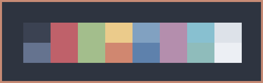
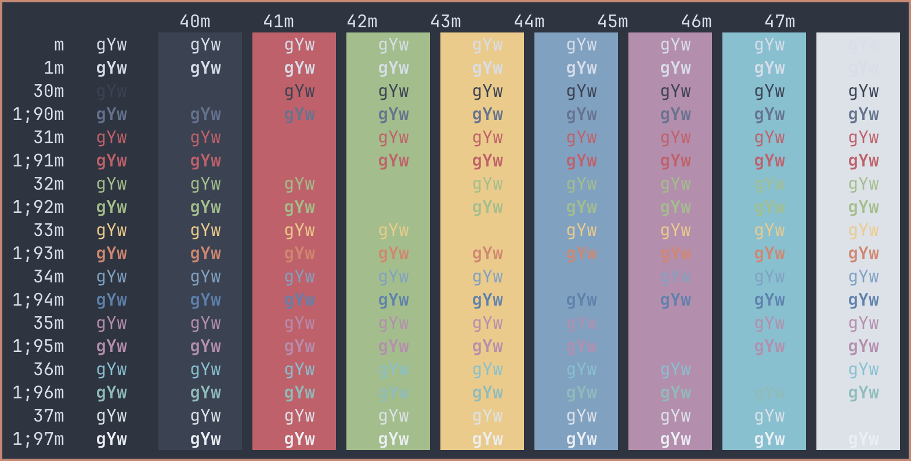
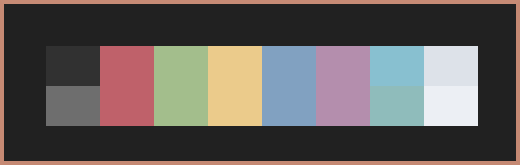
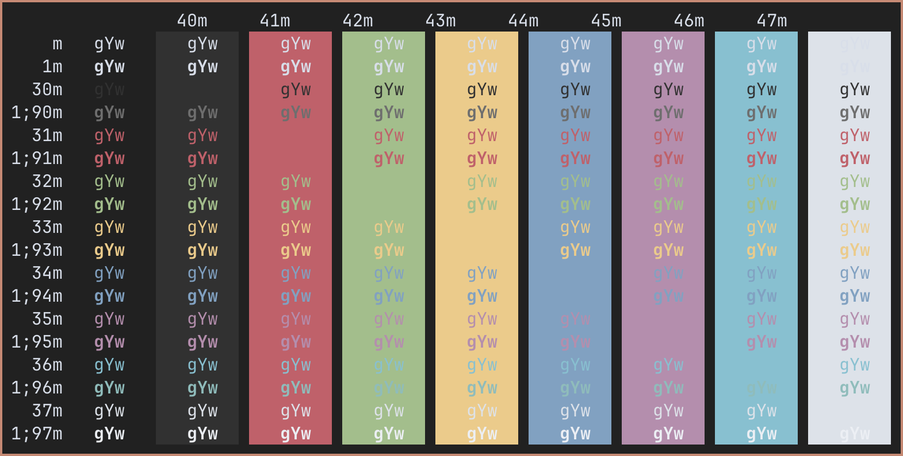

# Nord Ghostty
My own custom made Nord color schemes for Ghostty.

 

* [Ghostty for macOS and Linux](https://ghostty.org/)

* [Nord color palette](https://www.nordtheme.com/) 

Place files in ~/.config/ghostty/themes/ (create folders if non-existing).

*Nord II*

 

 

*Nord II Wave*

 

